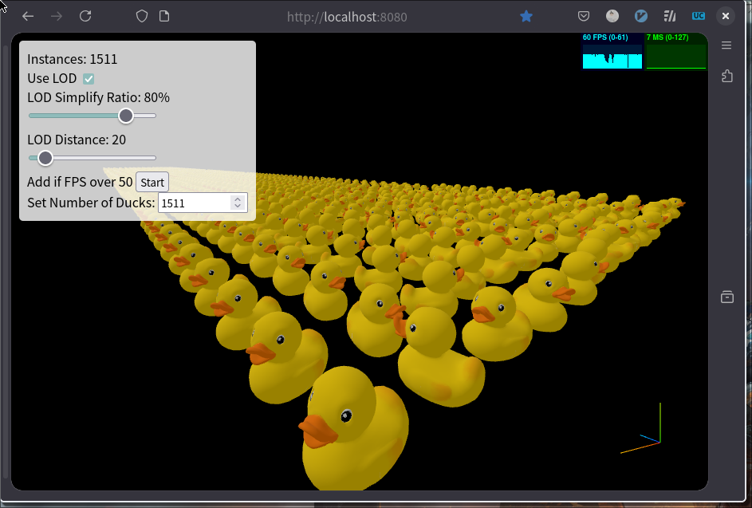
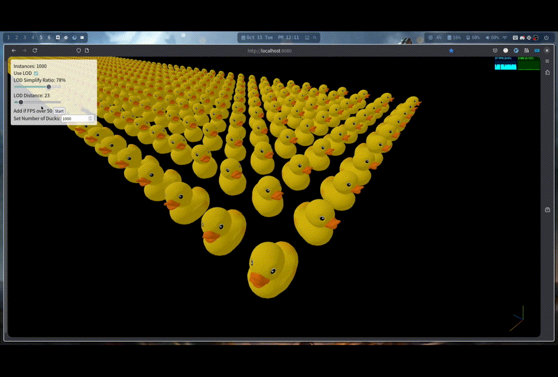
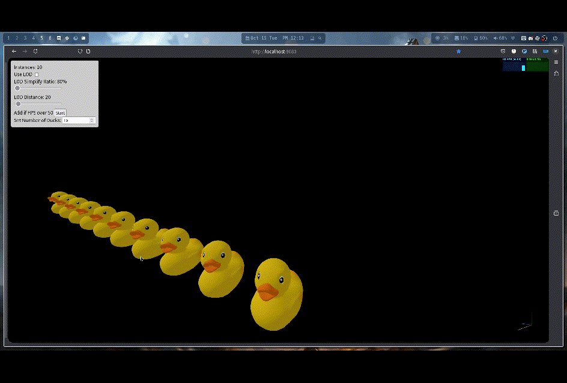

# Level of Duck

## Overview

The **Level of Duck Project** is an interactive 3D web application that demonstrates the Level of Detail (LOD) feature using a 3D model of a duck. Users can add multiple instances of the model, control rotation, and toggle LOD settings, all rendered in a Three.js scene.

### [Live Demo](https://jason9075.github.io/level-of-duck)

## Features

- **LOD Control**: Adjust the level of detail for the duck model to balance between rendering quality and performance.
  
  
  
- **Interactive Scene**: Rotate and manipulate the camera, change the number of duck instances, and adjust rotation on multiple axes.
  

## Technologies Used

- **Three.js**: A popular JavaScript library used for creating 3D graphics in the browser.
- **Stats.js**: To monitor FPS, memory, and rendering performance.

## Benchmark:

| Device      | CPU                                 | GPU                                   | Memory | OS                    | Browser                  | With LOD Score1 | Without LOD Score |
| ----------- | ----------------------------------- | ------------------------------------- | ------ | --------------------- | ------------------------ | -------------------------- | ----------------- |
| **PC**      | AMD Ryzen 9 5950X 16-Core Processor | NVIDIA GeForce RTX 3080 Ti            | 48GB   | NixOS 24.11           | Firefox 130.0.1 (64-bit) | 3061                       | 5131              |
| **MacBook** | Intel Core i5-7360U @ 2.3GHz        | Intel Iris Plus Graphics 640 (1536MB) | 8GB    | macOS Monterey 12.7.6 | Firefox 131.0.2 (64-bit) | 1611                       | 1811              |

_Settings for "With LOD Score": Simplify Ratio = 80%, Distance = 20_

I found that when LOD is enabled, the performance on both the PC and MacBook is worse. I think the main reason is that LOD uses two instances to represent one duck, and since the duck has only 4,212 triangles, the optimization effect of LOD is not significant, leading to this result.

## License

This project is licensed under the MIT License. See the [LICENSE](LICENSE) file for more details.
